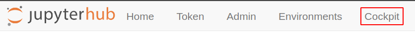
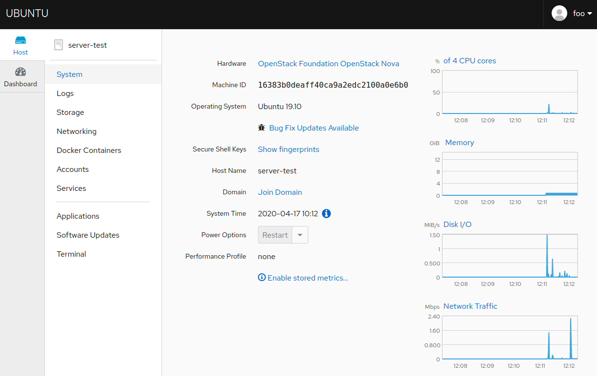
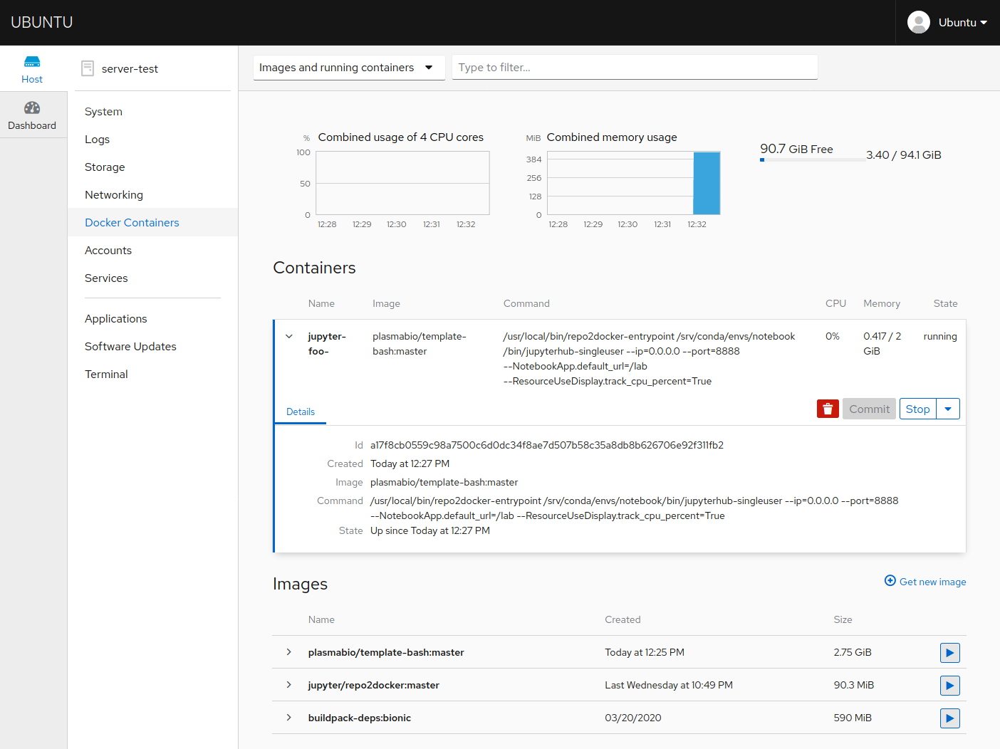
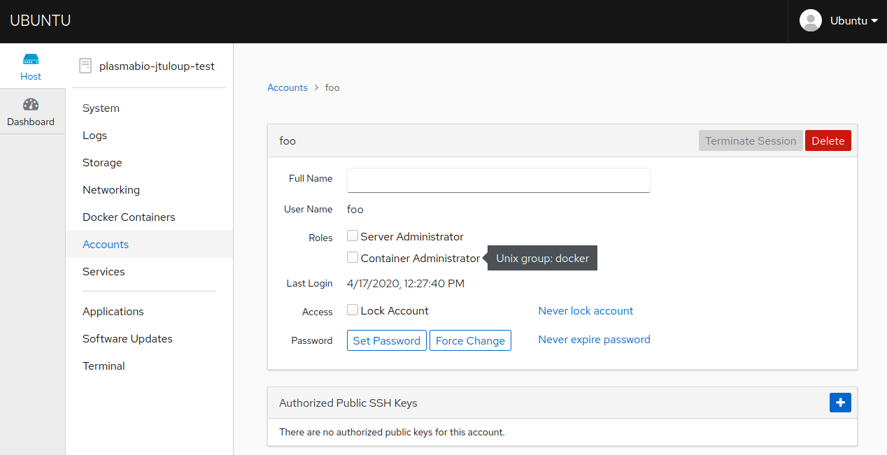

Monitoring
==========

.. warning::

  HTTPS must be enabled to be able to access Cockpit. Refer to :ref:`install/https` for more info.

Installing Cockpit
------------------

``cockpit`` is not installed by default as a monitoring tool for the server.

First make sure HTTPS is enabled and the ``name_server`` variable is specified in the ``hosts`` file.
See :ref:`install/https` for more info.

Then execute the ``cockpit.yml`` playbook:

.. code-block:: bash

    ansible-playbook cockpit.yml -i hosts -u ubuntu

The Plasma TLJH plugin registers ``cockpit`` as a JupyterHub service. This means that
Cockpit is accessible to JupyterHub admin users via the JupyterHub interface:

Users will be asked to login with their system credentials. They can then access the Cockpit dashboard:

Monitoring user servers with Cockpit
------------------------------------

.. note::

  Access to Docker Containers requires access to ``docker``.

  Make sure your user can access docker on the machine with:

  .. code-block:: bash

    sudo docker info

  Your user should also be able to login with a password. If the user doesn't have a password yet, you can
  create a new one with:

  .. code-block:: bash

    sudo passwd <username>

  For example if your user is ``ubuntu``:

  .. code-block:: bash

    sudo passwd ubuntu

  To add more users as admin or change permissions from the Cockpit UI, see :ref:`monitoring/permissions`.

Since user servers are started as Docker containers, they will be displayed in the Cockpit interface in the
``Docker Containers`` section:

The Cockpit interface shows:

- The username as part of the name of the Docker container
- The resources they are currently using
- The environment currently in use

It is also possible to stop the user server by clicking on the "Stop" button.

.. _monitoring/permissions:

Changing user permissions from the Cockpit UI
---------------------------------------------

.. note::

  You first need to be logged in with a user that has the ``sudo`` permission.

Cockpit makes it easy to add a specific user to a certain group.

For example a user can be given the "Container Administrator" role via the UI to be able to manage Docker containers
and images on the machine:

