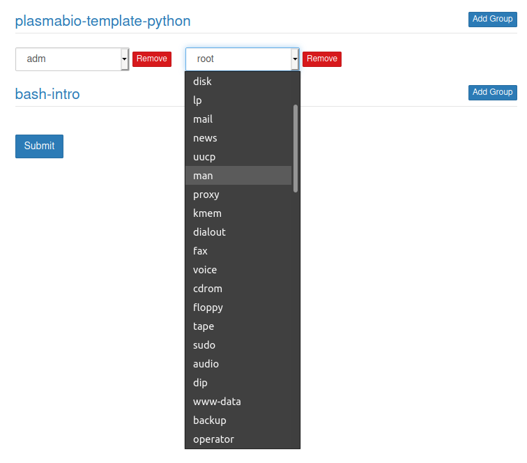
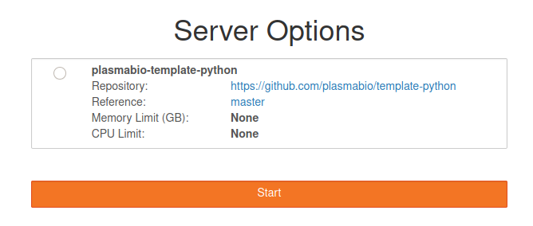

Permissions
===========

Since Plasma relies on UNIX system users created on the host machine, it can leverage UNIX `groups`
to enable fine-grained permission management.

The page to edit permissions is accessible via the navigation bar:

.. image:: ../images/configuration/permissions-navbar.png
   :alt: Manage the permissions
   :width: 100%
   :align: center

Mapping new groups to user environments
---------------------------------------

By default, users don't have access to any environment:

.. image:: ../images/configuration/permissions-empty.png
   :alt: No access to user environments
   :width: 100%
   :align: center

Environments can be added on a group level by clicking on the ``Add Group`` button and selecting
the group using the dropdown menu:

Saving the changes
------------------

Save the changes by clicking on the ``Submit`` button.

This will the page and show the updated list of permissions.

Choosing the environment on the spawn page
------------------------------------------

The environment will be listed on the spawn page if it is assigned to a group a user
belongs to:

