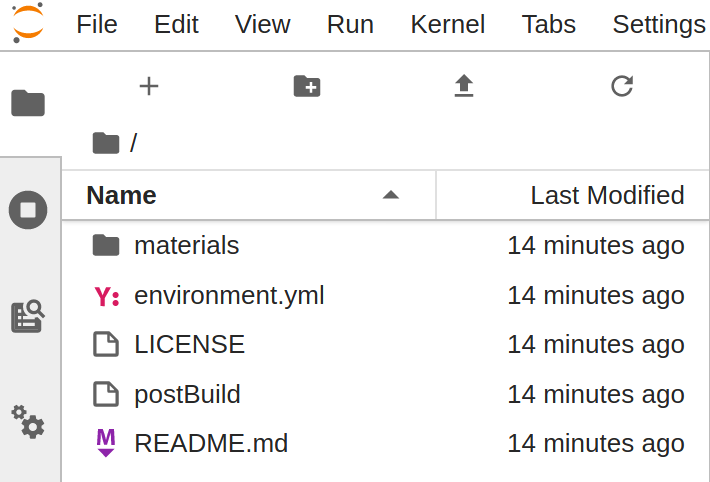

Data Persistence
================

.. _persistence/user-data:

User Data
---------

The user servers are started using JupyterHub's `SystemUserSpawner <https://github.com/jupyterhub/dockerspawner#systemuserspawner>`_.

This spawner is based on the `DockerSpawner <https://github.com/jupyterhub/dockerspawner#dockerspawner>`_, but makes it possible
to use the host users to start the notebook servers.

Concretely this means that the user inside the container corresponds to a real user that exists on the host.
Processes will be started by that user, instead of the default ``jovyan`` user that is usually found in the regular
Jupyter Docker images and on Binder.

For example when the user ``foo`` starts their server, the list of processes looks like the following:

.. code-block:: bash

   foo@9cf23d669647:~$ ps aux
   USER       PID %CPU %MEM    VSZ   RSS TTY      STAT START   TIME COMMAND
   root         1  1.1  0.0  50944  3408 ?        Ss   11:17   0:00 su - foo -m -c "$0" "$@" -- /srv/conda/envs/notebook/bin/jupyterhub-singleuser --ip=0.0.0.0 --port=8888 --NotebookApp.default_url=/lab --ResourceUseDisplay.track_cpu_percent=True
   foo         32  5.4  0.8 399044 70528 ?        Ssl  11:17   0:01 /srv/conda/envs/notebook/bin/python /srv/conda/envs/notebook/bin/jupyterhub-singleuser --ip=0.0.0.0 --port=8888 --NotebookApp.default_url=/lab --ResourceUseDisplay.track_cpu_percent=True
   foo         84  0.0  0.0  20312  4036 pts/0    Ss   11:17   0:00 /bin/bash -l
   foo        112 29.0  0.5 458560 46448 ?        Ssl  11:17   0:00 /srv/conda/envs/notebook/bin/python -m bash_kernel -f /home/foo/.local/share/jupyter/runtime/kernel-9a7c8ad3-4ac2-4754-88cc-ef746d1be83e.json
   foo        126  0.5  0.0  20180  3884 pts/1    Ss+  11:17   0:00 /bin/bash --rcfile /srv/conda/envs/notebook/lib/python3.8/site-packages/pexpect/bashrc.sh
   foo        140  0.0  0.0  36076  3368 pts/0    R+   11:17   0:00 ps aux

The following steps happen when a user starts their server:

1. Mount the user home directory on the host into the container. This means that the file structure in the container reflects what is on the host.
2. A new directory is created in the user home directory for each new environment (i.e for each Docker image).
   For example if a user starts the ``plasmabio/template-python:12345`` environment, there will be a new folder created under ``/home/user/plasmabio-template-python-12345``.
   This folder is then persisted to disk in the user home directory on the host. Any file and notebook created from the notebook interface are also persisted to disk.
3. On server startup, the entrypoint script copies the files from the base image that are initially in ``/home/jovyan`` to ``/home/user/plasmabio-template-python-12345`` in the container.
   They are then persisted in ``/home/user/plasmabio-template-python-12345`` on the host.

.. image:: ../images/configuration/persistence.png
   :alt: Mounting user's home directories
   :width: 80%
   :align: center

- The files highlighted in blue correspond to the files initially bundled in the environment. These files are copied to the environment subdirectory in the user home directory on startup.
- The other files are examples of files created by the user.

User server startup
-------------------

The user server is started from the environment directory:

The rest of the user files are mounted into the container, see :ref:`persistence/user-data`.

A user can for example open a terminal and access their files by typing ``cd``.

They can then inspect their files:

.. code-block:: text

   foo@3e29b2297563:/home/foo$ ls -lisah
   total 56K
    262882 4.0K drwxr-xr-x  9 foo  foo  4.0K Apr 21 16:53 .
   6205024 4.0K drwxr-xr-x  1 root root 4.0K Apr 21 16:50 ..
    266730 4.0K -rw-------  1 foo  foo   228 Apr 21 14:41 .bash_history
    262927 4.0K -rw-r--r--  1 foo  foo   220 May  5  2019 .bash_logout
    262928 4.0K -rw-r--r--  1 foo  foo  3.7K May  5  2019 .bashrc
   1043206 4.0K drwx------  3 foo  foo  4.0K Apr 21 09:26 .cache
    528378 4.0K drwx------  3 foo  foo  4.0K Apr 17 17:36 .gnupg
   1565895 4.0K drwxrwxr-x  2 foo  foo  4.0K Apr 21 09:55 .ipynb_checkpoints
   1565898 4.0K drwxr-xr-x  5 foo  foo  4.0K Apr 21 09:27 .ipython
   1565880 4.0K drwxrwxr-x  3 foo  foo  4.0K Apr 21 09:26 .local
    258181    0 -rw-rw-r--  1 foo  foo     0 Apr 21 16:53 out
   1050223 4.0K drwxrwxr-x 12 foo  foo  4.0K Apr 20 10:44 plasmabio-template-bash-master
   1043222 4.0K drwxrwxr-x 13 foo  foo  4.0K Apr 20 17:07 plasmabio-template-python-master
    262926 4.0K -rw-r--r--  1 foo  foo   807 May  5  2019 .profile
    258193 4.0K -rw-rw-r--  1 foo  foo   843 Apr 21 09:56 Untitled.ipynb

Shared Data
-----------

In addition to the user data, the plugin also mounts a shared data volume for all users.

The shared data is available under ``/srv/data`` inside the user server, as pictured in the diagram above.

On the host machine, the shared data should be placed under ``/srv/data`` as recommended in the
`TLJH documentation <http://tljh.jupyter.org/en/latest/howto/content/share-data.html#option-2-create-a-read-only-shared-folder-for-data>`_.

The shared data is **read-only**.
