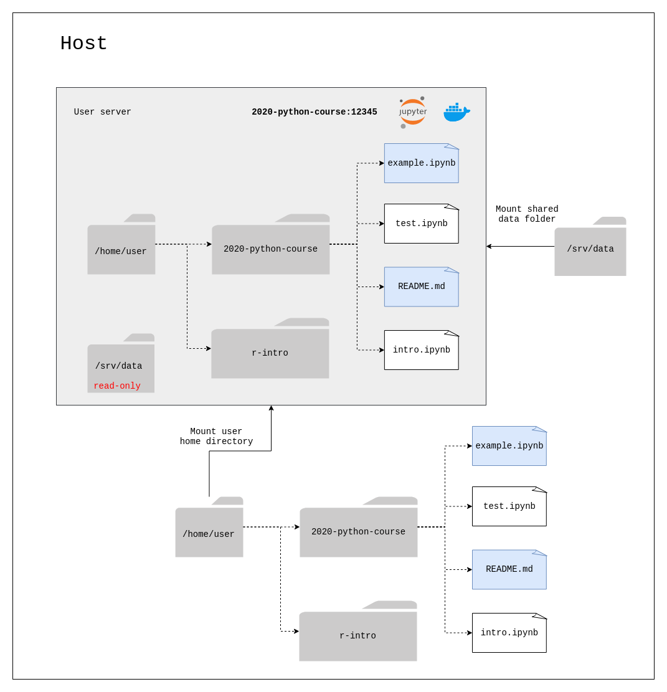

Data Persistence
================

.. _persistence/user-data:

User Data
---------

The user servers are started using JupyterHub's `SystemUserSpawner <https://github.com/jupyterhub/dockerspawner#systemuserspawner>`_.

This spawner is based on the `DockerSpawner <https://github.com/jupyterhub/dockerspawner#dockerspawner>`_, but makes it possible
to use the host users to start the notebook servers.

Concretely this means that the user inside the container corresponds to a real user that exists on the host.
Processes will be started by that user, instead of the default ``jovyan`` user that is usually found in the regular
Jupyter Docker images and on Binder.

For example when the user ``foo`` starts their server, the list of processes looks like the following:

.. code-block:: bash

   foo@9cf23d669647:~$ ps aux
   USER       PID %CPU %MEM    VSZ   RSS TTY      STAT START   TIME COMMAND
   root         1  1.1  0.0  50944  3408 ?        Ss   11:17   0:00 su - foo -m -c "$0" "$@" -- /srv/conda/envs/notebook/bin/jupyterhub-singleuser --ip=0.0.0.0 --port=8888 --NotebookApp.default_url=/lab --ResourceUseDisplay.track_cpu_percent=True
   foo         32  5.4  0.8 399044 70528 ?        Ssl  11:17   0:01 /srv/conda/envs/notebook/bin/python /srv/conda/envs/notebook/bin/jupyterhub-singleuser --ip=0.0.0.0 --port=8888 --NotebookApp.default_url=/lab --ResourceUseDisplay.track_cpu_percent=True
   foo         84  0.0  0.0  20312  4036 pts/0    Ss   11:17   0:00 /bin/bash -l
   foo        112 29.0  0.5 458560 46448 ?        Ssl  11:17   0:00 /srv/conda/envs/notebook/bin/python -m bash_kernel -f /home/foo/.local/share/jupyter/runtime/kernel-9a7c8ad3-4ac2-4754-88cc-ef746d1be83e.json
   foo        126  0.5  0.0  20180  3884 pts/1    Ss+  11:17   0:00 /bin/bash --rcfile /srv/conda/envs/notebook/lib/python3.8/site-packages/pexpect/bashrc.sh
   foo        140  0.0  0.0  36076  3368 pts/0    R+   11:17   0:00 ps aux

The following steps happen when a user starts their server:

1. Mount the directory for the environment from the host into the container using the name of the image.
   For example ``/home/user/plasmabio-template-python-12345`` will be mounted into ``/home/user/plasmabio-template-python-12345`` inside the container.
   This has the advantage that everything is persisted to disk whenever a file is created from the notebook interface.
   Also the file structure in the container reflects what is on the host.
2. A new directory is created in the user home directory for each new environment (i.e for each Docker image).
3. On server startup, the entrypoint script copies the files from the base image that are initially in ``/home/jovyan`` to ``/home/user/plasmabio-template-python-12345`` in the container.
   They are then persisted in ``/home/user/plasmabio-template-python-12345`` on the host.

- The files highlighted in blue correspond to the files initially bundled in the environment. These files are copied to the environment subdirectory in the user home directory on startup.
- The other files are examples of files created by the user.

Shared Data
-----------

In addition to the user data, the plugin also mounts a shared data volume for all users.

The shared data is available under ``/home/user/data`` inside the user server, as pictured in the diagram above.

On the host machine, the shared data should be placed under ``/srv/data`` as recommended in the
`TLJH documentation <https://github.com/plasmabio/plasmabio/blob/684515bfc5837705d89fc6a7863a69a561e8d15d/ansible/vars/default.yml#L4>`_.

The shared data is **read-only**.
