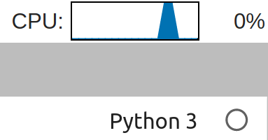

Resources
=========

PlasmaBio provides default values to limit the Memory and CPU usage.

Memory
------

By default PlasmaBio sets a limit of ``2GB`` for each user server.

This limit is enforced by the operating system, which kills the process if the memory consumption goes aboved this threshold.

Users can monitor their memory usage using the indicator in the top bar area if the environment has these dependencies
(see the :ref:`resources/display` section below).

CPU
---

By default PlasmaBio sets a limit of ``2 cpus`` for each user server.

This limit is enforced by the operating system, which throttles access to the CPU by the processes running in the
Docker container.

Users can monitor their CPU usage using the indicator in the top bar area if the environment has these dependencies
(see the :ref:`resources/display` section below).

.. _resources/display:

Displaying the indicators
-------------------------

To enable the Memory and CPU indicators as shown above, the following dependencies must be added to the user environment:

- ``nbresuse``
- ``jupyterlab-topbar-extension``
- ``jupyterlab-system-monitor``

As an example, checkout the following two links:

- `Adding nbresuse <https://github.com/plasmabio/template-python/blob/a4edf334c6b4b16be3a184d0d6e8196137ee1b06/environment.yml#L9>`_
- `Adding the JupyterLab extensions <https://github.com/plasmabio/template-python/blob/a4edf334c6b4b16be3a184d0d6e8196137ee1b06/postBuild#L4-L5>`_
