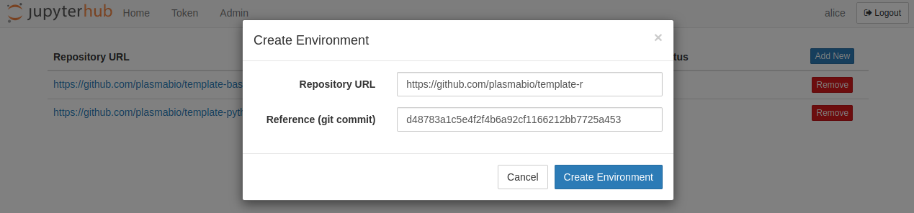
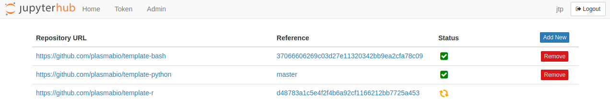

Adding a new environment
========================

Now that the repository is ready, we can add it to the JupyterHub via the user interface.

To add the new user environment, click on the ``Add New`` button and provide the following information:

- ``Repository URL``: the URL to the repository to build the environment from
- ``Reference (git commit)``: the git commit hash to use

As an example:

After clicking on the ``Add Image`` button, the page will automatically reload and show the list of built environments,
as well as the ones currently being built:

Building a new environment can take a few minutes. You can reload the page to refresh the status.
