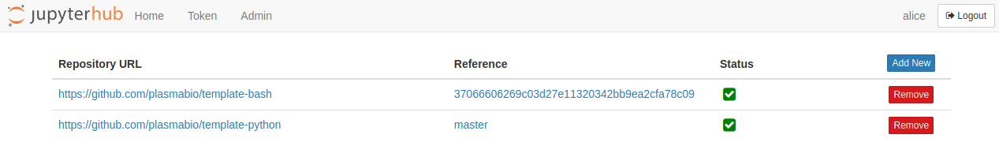

User Environments
=================

User environments are built as immutable `Docker images <https://docs.docker.com/engine/docker-overview>`_.
The Docker images bundle the dependencies, extensions, and predefined notebooks that should be available to all users.

PlasmaBio uses `jupyter-repo2docker <https://repo2docker.readthedocs.io>`_ to build the images on the server.

Environments can be managed by admin users by clicking on ``Services -> environments``:

.. note::

  The user must be an **admin** to be able to access and manage the list of environments.

The page will show the list of environments currently available:

After a fresh install, this list will be empty.

Managing User Environments
--------------------------

.. toctree::
   :maxdepth: 3

   prepare
   add
   remove
   update
