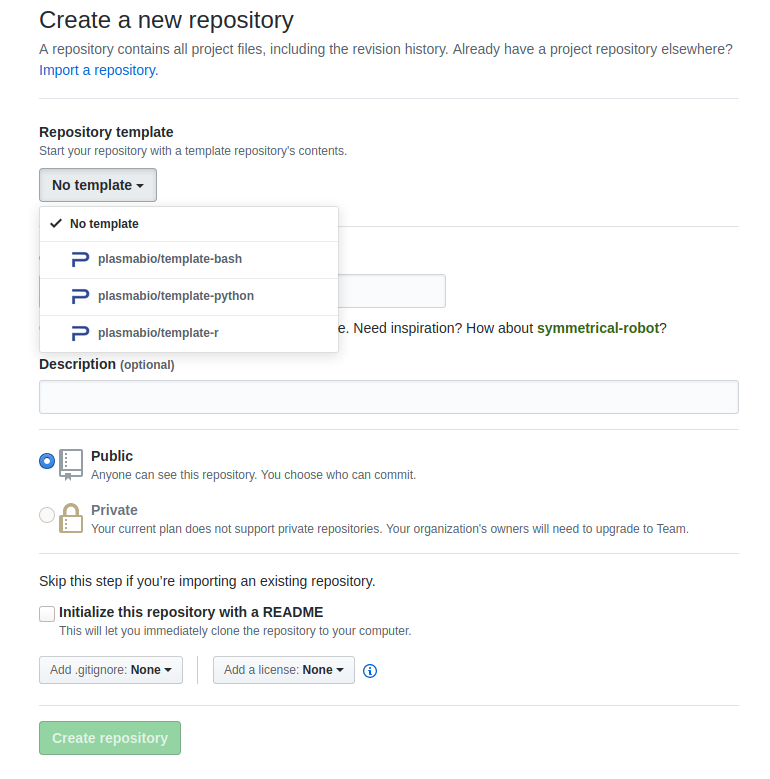
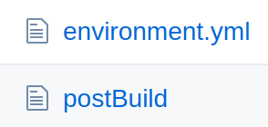

Preparing the environment
=========================

An `environment` is defined as an immutable set of dependencies and files.

Since Plasma uses `jupyter-repo2docker <https://repo2docker.readthedocs.io>`_, it relies on the same set of rules
and patterns as ``repo2docker`` to create the environments.

Create a new repository
.......................

Plasma fetches the environments from publicly accessible Git repositories from code sharing platforms such as `GitHub <https://github.com>`_.

To create a new environment with its own set of dependencies, it is recommended to create a new repository on GitHub.

The `plasmabio <https://github.com/plasmabio>`_ organization defines a couple of template repositories that can be used to bootstrap new ones:

- For Python: https://github.com/plasmabio/template-python
- For R: https://github.com/plasmabio/template-r
- For Bash: https://github.com/plasmabio/template-bash

To create a new repository using one of these templates, go to the organization and click on ``New``.

Then select the template from the ``Repository Template`` dropdown:

How to specify the dependencies
...............................

``repo2docker`` relies on a specific set of files to know which dependencies to install and how
to build the Docker image.

These files are listed on the `Configuration Files page <https://repo2docker.readthedocs.io/en/latest/config_files.html>`_ in the documentation.

In the case of the `Python Template <https://github.com/plasmabio/template-python>`_, they consist of an ``environment.yml`` and ``postBuild`` files:

.. _environments/prepare/binder:

Testing on Binder
.................

Since both Plasma and Binder use ``repo2docker`` to build the images, it is possible to try the
environment on Binder first to make sure they are working correctly before adding theme to the JupyterHub server.

The template repository has a Binder button in the ``README.md`` file. This button will redirect to the
public facing instance of BinderHub, `mybinder.org <https://mybinder.org>`_, and will build a Binder using the
configuration files in the repository.

You can use the same approach for the other environments, and update the Binder link to point to your repository.

Make sure to check out the documentation below for more details.

Extra documentation
...................

To learn more about ``repo2docker``, check out the `Documentation <https://repo2docker.readthedocs.io>`_.

To learn more about ``Binder``, check out the `Binder User Guide <https://mybinder.readthedocs.io/en/latest/index.html>`_.