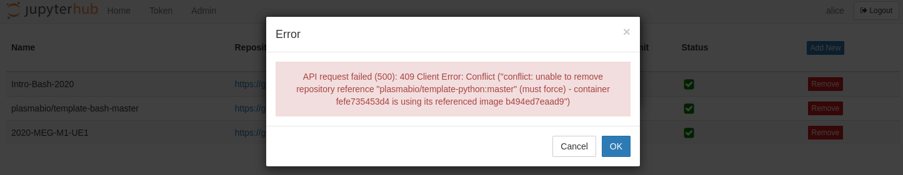
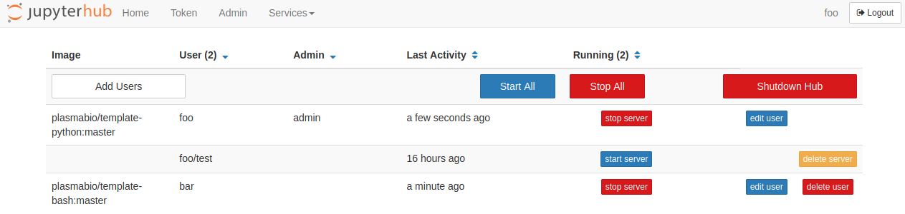

Removing an environment
=======================

To remove an environment, click on the ``Remove`` button. This will bring the following confirmation dialog:

.. image:: ../images/environments/remove-dialog.png
   :alt: Removing an environment
   :width: 100%
   :align: center

After clicking on ``Remove``, a spinner will be shown and the page will reload shortly after:

.. image:: ../images/environments/remove-spinner.png
   :alt: Removing an environment - spinner
   :width: 100%
   :align: center

.. _remove/error:

Removing an environment returns an error
----------------------------------------

It is possible that removing an environment returns an error such as the following:

This is most likely because the environment is currently in use by a user. We recommend asking the users to stop their server
before attempting to remove the environment one more time.

Alternatively the environment currently in use by a user is also displayed in the Admin panel:

