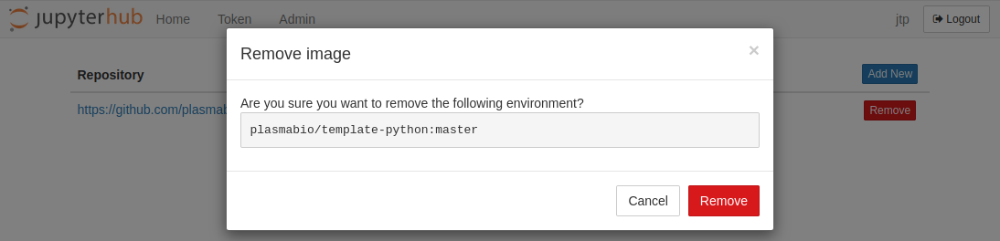
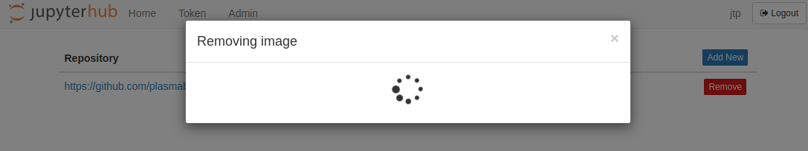

Removing an environment
=======================

To remove an environment, click on the ``Remove`` button. This will bring the following confirmation dialog:

After clicking on ``Remove``, a spinner will be shown and the page will reload shortly after:

