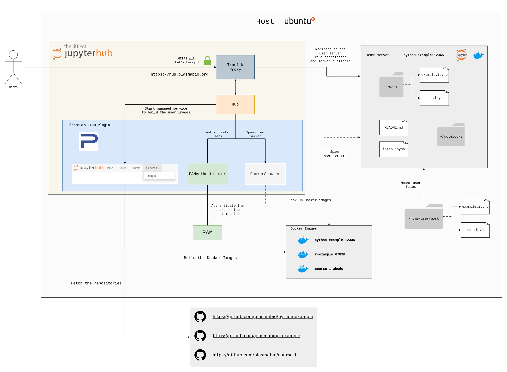

.. _overview/overview:

Overview
========

Plasma is built with `The Littlest JupyterHub <https://the-littlest-jupyterhub.readthedocs.io/en/latest/>`_ (TLJH)
and uses Docker containers to start the user servers.

The project provides:

- A TLJH plugin with a predefined JupyterHub configuration
- Ansible playbooks to automate the deployment on a new server
- Documentation for the plugin and the Ansible playbooks

Plasma can be seen as an **opinionated TLJH distribution**:

- It gives admin users the possibility to configure multiple user environments backed by Docker images
- It provides an interface to build the user environments, accessible from the JupyterHub panel
- It uses PAM as the authenticator, and relies on system users for data persistence (home directories) and authentication
- It provides additional Ansible Playbooks to provision the server with extra monitoring tools

Here is an overview of all the different components and their interactions after Plasma has been deployed on a new server:

The JupyterHub Documentation
----------------------------

Since Plasma is built on top of JupyterHub and The Littlest JupyterHub distribution, it benefits from its community
and high quality documentation.

For more information on these projects:

- `JupyterHub Documentation <https://jupyterhub.readthedocs.io>`_
- `The Littlest JupyterHub Documentation <https://the-littlest-jupyterhub.readthedocs.io>`_
