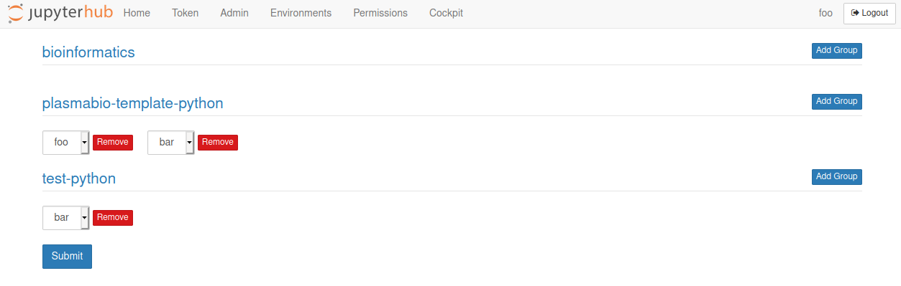

Permissions
===========

Since Plasma relies on UNIX system users that exist on the host machine,
it can leverage `UNIX groups` to enable permission management.

The Permissions page lets admin users configure which user groups have access to user environments.

Managing Permissions
--------------------

.. toctree::
   :maxdepth: 3

   groups
   edit
   spawn
