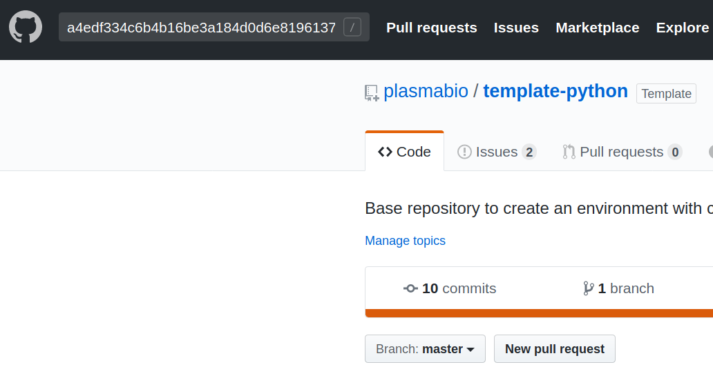

.. _troubleshooting/troubleshooting:

Troubleshooting
===============

.. contents:: Table of contents
    :local:
    :depth: 1

How to SSH to the machine
-------------------------

First make sure your SSH key has been deployed to the server. See :ref:`install/ssh-key` for more details.

Once the key is set up, connect to the machine over SSH using the following command:

.. code-block:: bash

  ssh ubuntu@51.178.95.143

Looking at logs
---------------

See: `The Littlest JupyterHub documentation <https://the-littlest-jupyterhub.readthedocs.io/en/latest/troubleshooting/logs.html>`_.

Why is my environment not building?
-----------------------------------

If for some reasons an environment does not appear after :ref:`environments/add`, it is possible that
there are some issues building it and installing the dependencies.

We recommend building the environment either locally with ``repo2docker`` (next section) or on Binder.

See :ref:`environments/prepare/binder` and the `repo2docker FAQ <https://repo2docker.readthedocs.io/en/latest/faq.html>`_
for more details.

Running the environments on my local machine
--------------------------------------------

To run the same environments on a local machine, you can use ``jupyter-repo2docker`` with the following parameters:

.. code-block:: bash

  jupyter-repo2docker --ref a4edf334c6b4b16be3a184d0d6e8196137ee1b06 https://github.com/plasmabio/template-python

Update the parameters based on the image you would like to build.

This will create a Docker image and start it automatically once the build is complete.

Refer to the `repo2docker documentation <https://repo2docker.readthedocs.io/en/latest/usage.html>`_ for more details.

My extension and / or dependency does not seem to be installed
--------------------------------------------------------------

See the two previous sections to investigate why they are missing.

The logs might contain silent errors that did not cause the build to fail.

The environment is very slow to build
-------------------------------------

Since the environments are built as Docker images, they can
`leverage the Docker cache <https://docs.docker.com/develop/develop-images/dockerfile_best-practices/#leverage-build-cache>`_
to make the builds faster.

In some cases Docker will not be able to leverage the cache, for example when building a Python or R environment for the first time.

Another reason for the build to be slow could be the amount of dependencies specified in files such as ``environment.yml`` or
``requirements.txt``.

Check out the previous section for more info on how to troubleshoot it.

Finding the source for an environment
-------------------------------------

If you are managing the environments, you can click on the ``Reference`` link in the UI,
which will open a new tab to the repository pointing the commit hash:

.. image:: ../images/troubleshooting/git-commit-hash.png
   :alt: The git commit hash on GitHub
   :width: 50%
   :align: center

If you are using the environments, the name contains the information about the repository
and the reference used to build the environment.

On the repository page, enter the reference in the search input box:

